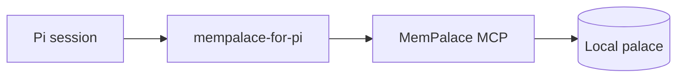

<div align="center">

# MemPalace for Pi

**Local-first project memory for [Pi](https://github.com/earendil-works/pi-mono), powered by the official [MemPalace](https://github.com/MemPalace/mempalace) core.**

Persistent findings, project recall, and agent diaries through four focused tools—without replacing MemPalace storage or migration ownership.

[Install](docs/public/install.md) · [Configure](docs/public/configuration.md) · [Compatibility](docs/public/compatibility.md) · [Privacy](docs/public/privacy.md) · [Troubleshooting](docs/public/troubleshooting.md)

</div>

> [!IMPORTANT]
> `mempalace-for-pi` is a community-maintained integration, not an official MemPalace core component. Pi extensions execute with your permissions, so review this repository before you install it.

## Why MemPalace for Pi

Pi sessions are intentionally disposable. Project knowledge should not be.

MemPalace for Pi connects each project to a durable local palace and exposes a deliberately small surface:

- **Project continuity** — recall decisions, invariants, and prior findings across sessions.
- **Local-first operation** — routine memory operations stay local after software and model assets are provisioned.
- **Explicit writes** — credential-shaped or non-retainable content is rejected before MCP dispatch.
- **Bounded context** — each session receives one deterministic, inert wake-up snapshot of this project's memory.
- **Optional per-turn recall** — opt in and every turn retrieves this project's memory relevant to the prompt.
- **Lifecycle safety** — disabling or removing the integration never removes palace data.

## Architecture



The integration handles Pi lifecycle, project identity, tool registration, and safety controls. With the verified MemPalace `3.9.0` support floor, it automatically starts a per-palace loopback Hub when no healthy registration exists and reuses a healthy Hub when one is already running. Palace data persists across Pi sessions; the upstream Hub may exit when idle, and the next operation starts or reuses it again. The separately installed MemPalace core remains responsible for storage, retrieval, and migrations.

## Quick start

### 1. Install the verified macOS ARM64 support floor

The verified support contract requires MemPalace `3.9.0` on macOS ARM64, Node `22.19.0` or `24.x`, and Pi `0.84.2`. Linux is withdrawn from the current package contract and Windows remains outside scope.

```bash
uv tool install --python 3.12 'mempalace==3.9.0'
npm install -g --ignore-scripts @earendil-works/pi-coding-agent@0.84.2

mempalace --version
pi --version
```

For an existing installation, update both MemPalace and `mempalace-for-pi` from the same approved source, then restart Pi. The exact procedure is in the [installation guide](docs/public/install.md).

### 2. Install the integration into your project

```bash
cd /path/to/your/project
pi install -l npm:mempalace-for-pi --approve
pi list --approve
```

To install the reviewed source directly instead, substitute `git:github.com/NoahWTeng/mempalace-for-pi`. Both deliver the same artifact; see [install](docs/public/install.md).

`pi list` should show `mempalace-for-pi`. A project-local install writes project configuration, so Pi asks you to trust the project folder; `--approve` states that decision.

### 3. Declare the project's memory

```bash
mkdir -p .pi
cat > .pi/mempalace.json <<'JSON'
{
  "version": 1,
  "palace": "~/palaces/your-project"
}
JSON
```

Or run `/mempalace-init` inside Pi, which writes the same document and refuses to overwrite an existing declaration.

Commit `.pi/mempalace.json` with the project. Because the palace is written in the `~/` form, another computer that checks the project out reads the same declaration and needs no repeated export. The document is read at every session start, and only after the project folder is trusted.

### 4. Start Pi in the project

```bash
export MEMPALACE_BACKEND=sqlite_exact
export MEMPALACE_BACKEND_EXPLICIT=sqlite_exact
pi --approve
```

Then ask Pi:

> Use `palace_status` and report whether this project palace is operational.

Continue with non-sensitive test content: save one finding, search for it, write and read one diary entry, then check status again. Daily `palace_search`, `palace_save`, `palace_diary`, and `palace_status` behavior remains unchanged through the Hub transition. The complete walkthrough lives in the [installation guide](docs/public/install.md).

## Tools

| Tool | Purpose |
| --- | --- |
| `palace_search` | Find relevant stored project knowledge. |
| `palace_save` | Persist one non-sensitive finding after duplicate detection. |
| `palace_diary` | Read or write a bounded agent diary entry. |
| `palace_status` | Inspect core, palace, and drawer status. |

## Prompt templates

| Command | Purpose |
| --- | --- |
| `/mempalace-init [palace-path]` | Declare this project's memory in `.pi/mempalace.json`. |

`/mempalace-init` reports and stops when the project already declares a palace, because replacing that declaration would strand the memory behind it. It writes a project file and nothing else: it starts no process, reads no palace, and reaches no network.

No additional public tool or slash command is registered.

## Safety controls

| Control | Behavior |
| --- | --- |
| `MEMPALACE_READ_ONLY=1` | Allows recall while refusing all integration writes before dispatch. |
| `MEMPALACE_HANDOFF=1` | Enables one bounded pre-compaction diary handoff; disabled by default. |
| `MEMPALACE_BRIDGE_DISABLE=1` | Starts no core process, tools, wake-up capture, handoff, or background work. |
| `MEMPALACE_RECALL=1` | Opts in to per-turn retrieval of project memory relevant to the prompt. |
| `MEMPALACE_PALACE=<path>` | Reconnects an existing palace without moving or modifying it. |
| `.pi/mempalace.json` | Declares `palace`, `readOnly`, `handoff`, `disabled`, or `recall` for the whole project; refused as a whole if it is not exactly `"version": 1` plus known keys. |
| `retain:false` | Rejects the entire write candidate. |
| First-line `[no-memory]` | Rejects the entire write candidate. |

Environment variables win over the project document, field by field, and the document wins over the built-in defaults. Credential-shaped content in either content or metadata is rejected as a whole. There is no partial redaction, truncation into acceptance, or override. See [configuration](docs/public/configuration.md) for the exact document contract, executable resolution, project identity, worktrees, and all environment variables.

## Privacy boundary

The verified support-floor path remains local-first. After provisioning, routine wake-up, search, save, diary, status, and handoff operations use the loopback Hub and require no routine non-loopback network access.

Two boundaries remain outside this claim:

1. Pi's configured model provider may use the network.
2. An explicitly configured remote MemPalace backend may use the network.

The integration does not discover, copy, merge, migrate, move, or delete another palace. Read the full [privacy boundary](docs/public/privacy.md) before using real project data.

## Verified compatibility

The verified support floor is MemPalace `3.9.0` on macOS ARM64 with exactly two cells: Node `22.19.0` and `24.x`, each with Pi `0.84.2`. Both cells produced exact, SHA-bound PASS evidence.

MemPalace `3.6.0` and `3.7.1` remain historical migration context only; they are not the current support floor or a current PASS claim. See [compatibility](docs/public/compatibility.md) for the exact current matrix and historical boundary.

## Documentation

| Guide | Covers |
| --- | --- |
| [Installation](docs/public/install.md) | Verified support-floor setup, updates, Hub startup, and first use. |
| [Configuration](docs/public/configuration.md) | Environment controls, project identity, worktrees, and write policy. |
| [Privacy](docs/public/privacy.md) | Storage, networking, non-retention, and credential boundaries. |
| [Migration](docs/public/migration.md) | Existing palaces, disable, removal, reinstall, upgrade, and rollback. |
| [Troubleshooting](docs/public/troubleshooting.md) | Missing core, timeouts, permissions, compatibility, and cleanup. |
| [Compatibility](docs/public/compatibility.md) | Verified current matrix and historical migration scope. |

## Development

```bash
npm ci
npm test
npm run check
npm run check:repository
npm run release:check
```

The repository boundary and packed package are independently checked. Release gates fail closed on test, package, audit, lifecycle, or evidence errors.

## Release status

Version `0.1.0` is published: tagged `v0.1.0`, released on npm as [`mempalace-for-pi`](https://www.npmjs.com/package/mempalace-for-pi), and installable from this repository. Both sources carry one artifact — the tag, the npm tarball, and the SHA-256 recorded in [compatibility](docs/public/compatibility.md) describe the same bytes.

## License

[MIT](LICENSE)
